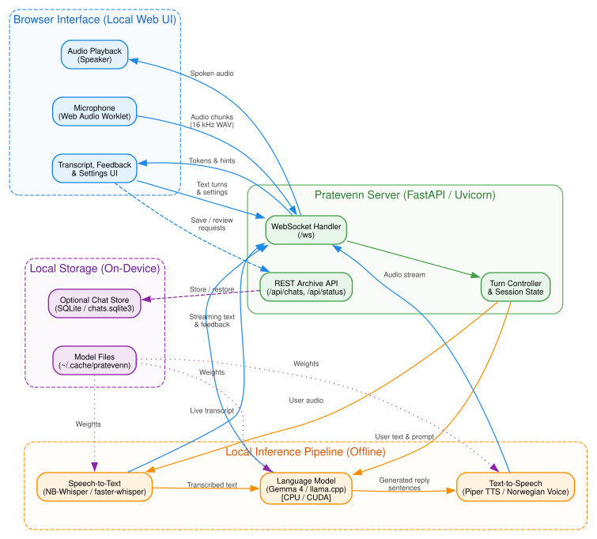

<div align="center">
  <picture>
    
  </picture>
<br>

<h2>Pratevenn</h2>

[](https://github.com/UrukiApp/pratevenn/actions/workflows/tests.yml)
[](https://codecov.io/gh/UrukiApp/pratevenn)
[](LICENSE)
[](https://github.com/UrukiApp/pratevenn/pkgs/container/pratevenn)

A private, local conversational AI tool for Norwegian language learners

</div>

---

Pratevenn lets you practice speaking Norwegian with an AI on your own computer while everything stays on your machine.

### Key Features

- Full real-time conversation in natural Norwegian Bokmål with a simple UI
- Fully private and offline (no internet or cloud accounts needed)
- Shows grammar tips as you chat and lets you review your mistakes
- Supports both CPU and NVIDIA GPUs (for faster replies)

### How It Works

The diagram below shows the architecture of Pratevenn and its components.

<div align="center">
  
</div>

---

### Getting Started

#### Running with Docker Compose

##### 1. Compose Configuration

Use the included [docker-compose.yaml](docker-compose.yaml), or save the text below as `docker-compose.yml`:

```yaml
services:
  pratevenn:
    image: ghcr.io/urukiapp/pratevenn:latest-cpu
    environment:
      - PRATEVENN_MODEL_DIR=/models
      - PRATEVENN_HOST=0.0.0.0
      - PRATEVENN_ALLOWED_HOSTS=*
    ports:
      - "8000:8000"
    volumes:
      - models:/models
    restart: unless-stopped

  pratevenn-cuda:
    image: ghcr.io/urukiapp/pratevenn:latest-cuda
    environment:
      - PRATEVENN_MODEL_DIR=/models
      - PRATEVENN_HOST=0.0.0.0
      - PRATEVENN_ALLOWED_HOSTS=*
      - NVIDIA_VISIBLE_DEVICES=all
      - NVIDIA_DRIVER_CAPABILITIES=compute,utility
    ports:
      - "8000:8000"
    volumes:
      - models:/models
    deploy:
      resources:
        reservations:
          devices:
            - driver: nvidia
              count: all
              capabilities: [gpu]
    profiles:
      - cuda
    restart: unless-stopped

volumes:
  models:
```

##### 2. Download the Models

Download the default models before starting the container:

```sh
docker compose run --rm pratevenn setup
```

##### 3. Start Pratevenn

Start the CPU version:

```sh
docker compose up -d
```

If you have an NVIDIA GPU on your machine, start the CUDA version instead:

```sh
docker compose --profile cuda up -d pratevenn-cuda
```

Open <http://localhost:8000> in your browser and click *Start conversation*.

#### Managing Containers

Use standard Docker Compose commands to manage Pratevenn:

```sh
docker compose up -d                    # Start Pratevenn
docker compose stop                     # Stop Pratevenn (keeps your models and data)
docker compose down                     # Remove containers
docker compose down -v                  # Remove containers (and downloaded models)
docker compose logs -f                  # Check the logs
```

---

### Contributing

See [CONTRIBUTING.md](CONTRIBUTING.md) to learn how to contribute.

### Acknowledgments

Pratevenn uses the following open-source projects and models for its core functionality:

- [NB-Whisper](https://github.com/NbAiLab/nb-whisper) for Norwegian speech recognition.
- [Piper](https://github.com/OHF-Voice/piper1-gpl) for text-to-speech synthesis.
- [Gemma models](https://ai.google.dev/gemma) for the conversation and reviewing the chat.
- [llama.cpp](https://github.com/ggerganov/llama.cpp) and [llama-cpp-python](https://github.com/abetlen/llama-cpp-python) for inference on CPU and GPU.
- [faster-whisper](https://github.com/SYSTRAN/faster-whisper) for speech-to-text transcription.

### License

Pratevenn is licensed under the MIT License (see [LICENSE](LICENSE)).
